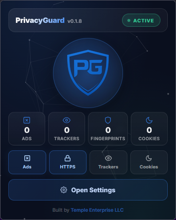

  

  
  
  
  
  
  

  <b>Your all-in-one privacy toolkit for Firefox.</b> 
  Block ads, trackers, fingerprinting, crypto miners, and more — all from a single extension.

---

## ✨ Features

| Category | Features |
|----------|----------|
| 🚫 **Blocking** | Ad blocking, tracker blocking, crypto miner blocking, social widget blocking, web beacon blocking |
| 🔒 **HTTPS** | Auto-upgrade HTTP → HTTPS, HTTP warning interstitial page |
| 🔏 **Privacy** | Anti-fingerprinting, referrer control, user-agent spoofing, WebRTC leak protection |
| 🍪 **Cookies** | Third-party cookie blocking, auto-delete cookies, hyperlink audit disabling |
| 💾 **Storage** | localStorage/sessionStorage/IndexedDB management with multiple modes |
| 🌐 **Network** | SOCKS5/HTTP/HTTPS proxy support, URL tracking parameter stripping, request timeout control |
| 🎭 **Decoy Traffic** | Generate background requests to blend your browsing pattern |
| 📊 **Statistics** | Track blocked ads, trackers, cookies, fingerprints, and more |
| ⚙️ **Management** | Site whitelist, settings import/export, custom block & allow lists |

---

## 📸 Showcase

  

---

## 🚀 Getting Started

### Installation (Developer Mode)

1. Open Firefox and navigate to `about:debugging#/runtime/this-firefox`
2. Click **Load Temporary Add-on…**
3. Select the `manifest.json` file from this project
4. The **PrivacyGuard** icon will appear in your toolbar

### Usage

- **Click the toolbar icon** to open the popup dashboard
- **Toggle the master switch** to enable/disable all protections
- **Use quick toggles** in the popup for fast control over key features
- **Open Settings** for full configuration of all privacy features

---

  Built by <a href="https://templeenterprise.com"><b>Temple Enterprise LLC</b></a>

